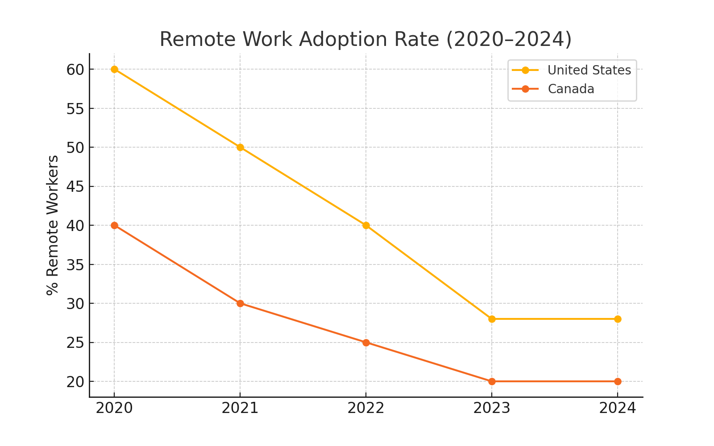
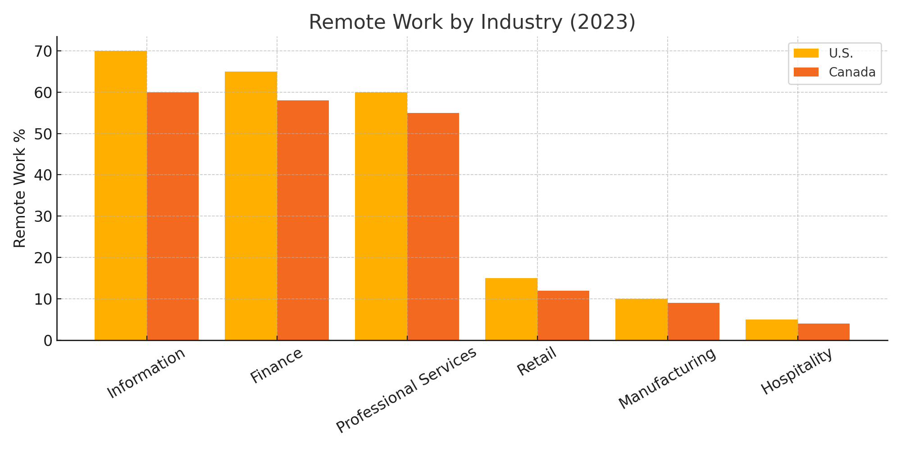
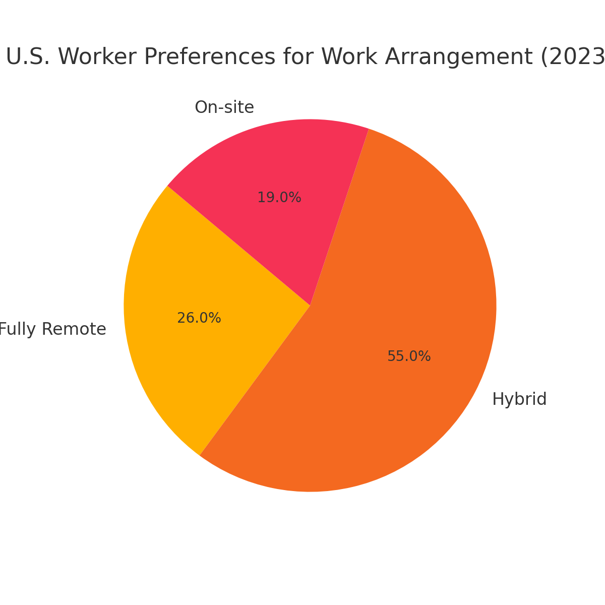
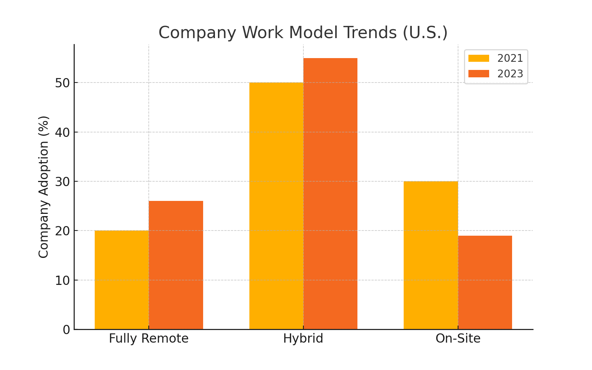
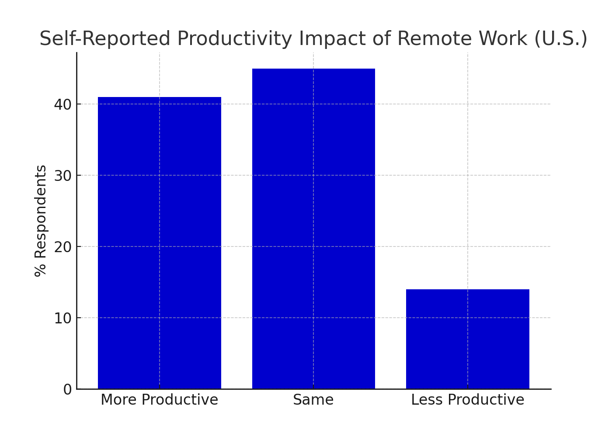
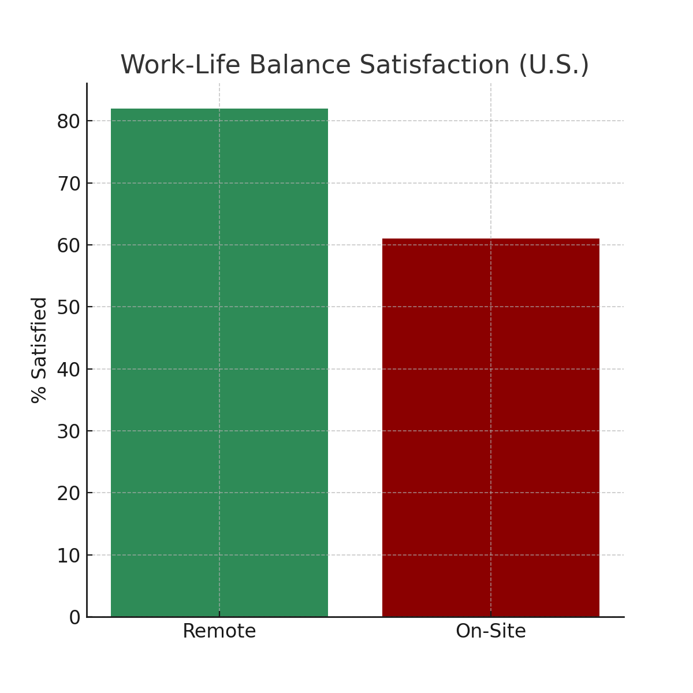

## 📊 Visual Insights

### 🟢 1. Remote Work Adoption (U.S. vs. Canada, 2020–2024)

---

### 🏭 2. Remote Work by Industry

---

### 👤 3. Worker Preferences (2024)

---

### 💼 4. Company Policy Trends

---

### 🧠 5. Productivity Impact of Remote Work

---

### 😊 6. Work-Life Satisfaction Ratings

